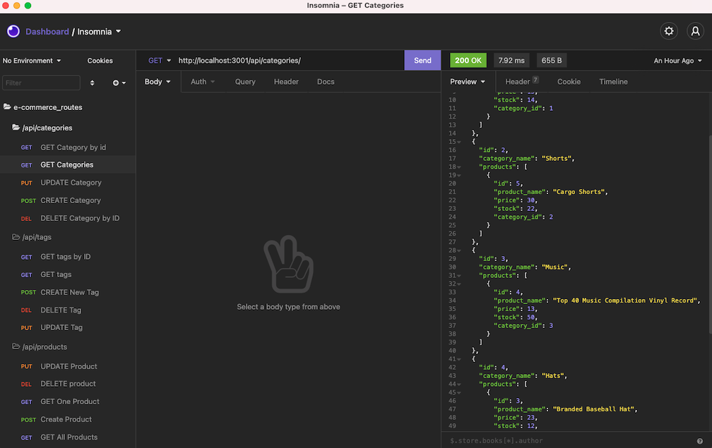

# internet-retail-company
Internet-retail-company app is a back-end of ecommerce website. This app is configured via a working Express.js API to use Sequelize to interact with a MySQL database.

## Getting Started

* clone me, or fork me
* 🌎 live at: [github pages] ( https://ir-p.github.io/internet-retail-company/)

* Screen shot of the deployed app: 
* 
* 
* 

* [Watch the video](https://drive.google.com/file/d/1esp2-fUAC5H-0SzwC2iBlJt5238Bj8UQ/view?usp=sharing)
## Deployment
* just deploy, no other actions needed

## Build With 

* [expressjs] (https://expressjs.com/en/5x/api.html) - express()

## Acknowledgements
* **Billie Thompson** - *README template* - [PurpleBooth](https://github.com/PurpleBooth)